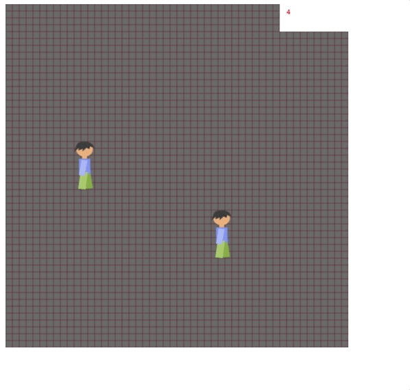

## Game engine in JS

The idea of this is a creation of unity-like game engine for simple 2d games.

### Main features (for now)
* Game objects
* Sprite loading
* Keyboard input handling
* Resolution (for snake style games)
* Simple animator
* Helpers (RGBA, Math, Vector classes)

### How it looks



### Example

#### Initialization
```
document.addEventListener('DOMContentLoaded', function() {
    // create engine instance and append canvas to parent
    const engine = new Engine({width: 500, height: 500, canvasResolution: 10, debug: true});
    const root = document.getElementById('root');
    engine.CreateCanvas(root);
    
    // set canvas bg color
    const bgColor = new RGBAColor(0,0,0, 150);
    engine.SetBackgroundColor(bgColor);

    // instantiate GameObjects and register in engine
    const gameObject = new Man({
        position: new Vector(10, 20)
    });
    engine.AppendGameObject(gameObject);

    const gameObject2 = new ManTwo({
        position: new Vector(30, 30)
    });
    engine.AppendGameObject(gameObject2);

    engine.Start();
});
```

#### GameObject
```
class Man extends GameObject {
    constructor(params) {
        super(params);
        // some initial props
        this.horizontalDir = 0;
        this.prevHorDir = 1;
        this.verticalDir = 0;
    }

    // unity-style Start and Render
    Start() {
    
        // create sprite
        const graphic = new GraphicElement({
            url: './assets/dude_idle.png',
            width: 3, height: 7,
        });


        // create animator
        this.animator = new Animator({
            frameDelay: 100, // delay between frames
            stateMap: {
                idle: ['./assets/dude_idle.png'],
                running: ['./assets/dude_run1.png', './assets/dude_idle.png', './assets/dude_run2.png', './assets/dude_idle.png',],
            }, // array of sprite urls per animator state
            state: 'idle', // default state
            graphicElement: graphic, // link to sprite component
        });
        // apply sprite component to game object
        this.SetGraphicsContent(graphic);
    }

    CheckHorizontalInputs() {
        // static InputSystem class to check for keyboard keys
        if(InputSystem.KeyPressed('KeyA')) return -1;
        if(InputSystem.KeyPressed('KeyD')) return 1;
        return 0;
    }

    CheckVerticalInputs() {
        if(InputSystem.KeyPressed('KeyW')) return -1;
        if(InputSystem.KeyPressed('KeyS')) return 1;
        return 0;
    }


    // state handling per frame magic
    Render() {
        this.horizontalDir = this.CheckHorizontalInputs();
        this.verticalDir = this.CheckVerticalInputs();
        if(!!this.horizontalDir || !!this.verticalDir) {
            this.prevHorDir = this.horizontalDir || this.prevHorDir;
            this.animator.SetState('running');
        } else {
            this.animator.SetState('idle');
        }
        if(this.graphic) this.graphic.SetScale(this.horizontalDir || this.prevHorDir);
        this.position.Translate(0.1 * this.horizontalDir, 0.1 * this.verticalDir);
        
        // destroy available
        // if(this.position.x > 150) this.Destroy();
    }
}
```