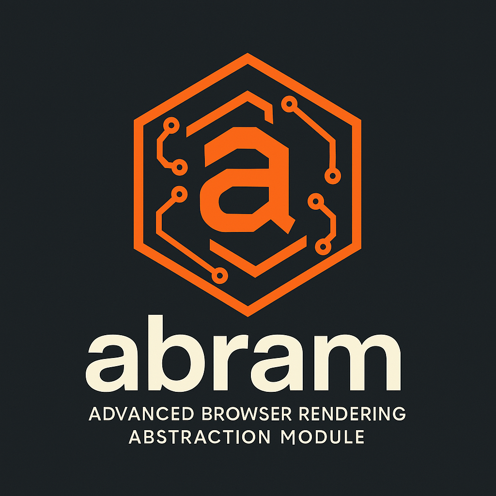

# ABRAM

**Advanced Browser Rendering Abstraction Module** — a Unity-inspired 2D game engine for the browser, built with TypeScript. Zero runtime dependencies.

<p align="center">
  
</p>

## Features

- **Component-based architecture** — GameObjects hold Modules (Sprite, Rigidbody, Collider, Animator, TrailRenderer, etc.)
- **Parent-child transforms** — nested position, rotation, and scale with world coordinate propagation
- **Impulse-based physics** — gravity, forces, drag, collision detection and response via circle colliders
- **Particle system** — emit over time/distance/burst, pooling, sub-emitters, lifetime curves, occlusion culling
- **Sprite animation** — state machine animator with frame-based transitions
- **Trail rendering** — configurable width/color over trail lifetime
- **Keyboard input** — static InputSystem with press tracking and event listeners
- **Camera** — position, zoom/scale, center tracking
- **Math utilities** — Vector, Point, Polar coordinates, Bezier curves, color interpolation

## Quick Start

### Browser (script tag)

```html
<script src="path/to/abram.js"></script>
<script>
const { Engine, GameObject, Classes: { Vector, RGBAColor } } = window.Abram;

const root = document.getElementById('root');
const engine = new Engine(root, {
    width: 1280,
    height: 800,
    drawFps: true,
    bgColor: new RGBAColor(30, 30, 30),
});

engine.AppendGameObject(new MyGameObject({ position: new Vector(0, 0) }));
engine.Start();
</script>
```

### npm

```bash
npm install abram (NOT PUBLISHED YET)
```

```js
import Engine, { GameObject, Classes } from 'abram';
const { Vector, RGBAColor } = Classes;
```

## Creating a GameObject

```js
class Player extends GameObject {
    Start() {
        const sprite = new Sprite({
            image: new ImageWrapper('./player.png'),
            width: 64,
            height: 64,
            layer: 1,
        });
        this.RegisterModule(sprite);

        this.rb = new RigidBody({ useGravity: true, mass: 1, drag: 0.5 });
        this.RegisterModule(this.rb);
    }

    Update() {
        if (InputSystem.KeyPressed('ArrowRight')) {
            this.rb.AddForce(new Vector(5, 0));
        }
        super.Update();
    }
}
```

## Lifecycle

Every `GameObject` and `Module` follows the lifecycle: **Start()** (called once, on first frame) -> **Update()** (called every frame) -> **Destroy()**.

Physics, rendering, and collisions are processed automatically by the engine after `Update()`.

## Build

```bash
npm run build       # full pipeline: clear -> tsc -> webpack
npm run build-ts    # TypeScript only
npm run bundle      # webpack only
npm run lint        # ESLint
```

## Examples

The `examples/` directory contains working demos:

| Example | Description |
|---------|-------------|
| `simple-game` | Character movement with sprites, animation, and input |
| `collisions-detection` | Circle collider physics with spawning |
| `particle-system` | Particle effects with lifetime curves |
| `particle-collisions` | Particles with collision physics |
| `fireworks-particle` | Fireworks with sub-emitters and time scaling |
| `planets-patterns` | Orbital mechanics with trail renderers |
| `bezier-curve` | Bezier curve visualization |
| `colors` | RGBAColor manipulation and gradients |

Open any example's `index.html` in a browser after running `npm run build`.

## Documentation

Detailed API docs are in the [`docs/`](./docs) folder:

- [Engine](./docs/engine.md) — initialization and configuration
- [GameObjects & Transforms](./docs/gameobjects.md) — scene hierarchy and transforms
- [Modules](./docs/modules.md) — Sprite, Animator, Rigidbody, Collider, TrailRenderer
- [Particle System](./docs/particles.md) — emitters, lifetime curves, sub-emitters
- [Math & Utilities](./docs/math.md) — Vector, Point, RGBAColor, Maths, and more
- [Input](./docs/input.md) — keyboard handling

## License

ISC
